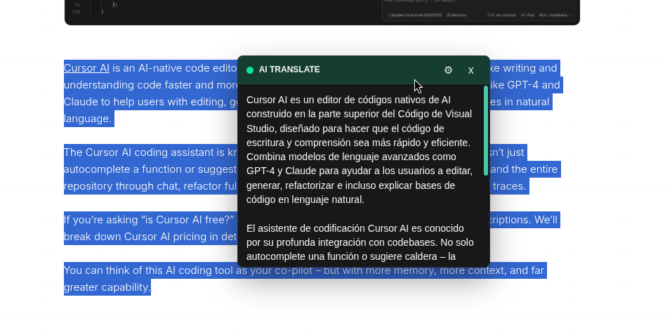
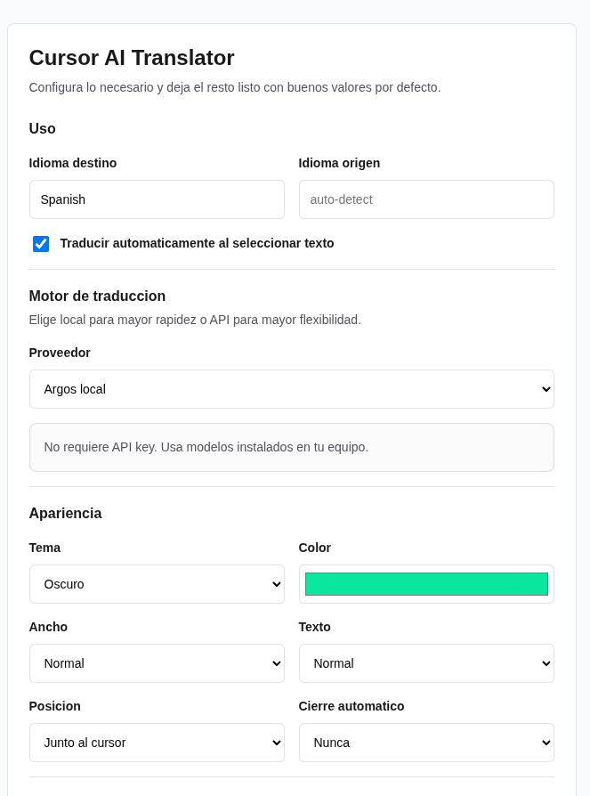

# Cursor AI Translator

Extension de navegador que detecta texto seleccionado y muestra una traduccion junto al cursor. Esta pensada para funcionar rapido con proveedores locales como Argos Translate u Ollama, y conserva soporte opcional para APIs remotas.



## Que incluye

- Burbuja flotante cerca del cursor cuando seleccionas texto.
- Traduccion automatica configurable desde la pagina de opciones.
- Configuracion local sencilla desde la pagina de opciones.
- Backend local en Node.js.
- Endpoint de salud para verificar que el servidor este corriendo.

## Estructura

```text
cursor-ai-translator/
├── assets/
│   ├── logo.png
│   ├── preview1.png
│   └── preview2.png
├── extension/
│   ├── background.js
│   ├── content.css
│   ├── content.js
│   ├── icons/
│   │   ├── icon-16.png
│   │   ├── icon-32.png
│   │   ├── icon-48.png
│   │   └── icon-128.png
│   ├── manifest.json
│   ├── options.css
│   ├── options.html
│   └── options.js
├── .env.example
├── LICENSE
├── local-translator/
│   ├── install_model.py
│   ├── requirements.txt
│   └── worker.py
├── package.json
├── README.md
└── server.mjs
```

## Capturas

### Burbuja de traduccion


### Configuracion principal



## Arranque local

1. Instala dependencias:

```bash
npm install
```

2. Inicia el servidor local:

```bash
npm start
```

La primera vez, el servidor genera un **token de pareo** y lo imprime en consola:

```text
Pairing token generated. Paste it in the extension Options page:
  3f1a...c9e2
```

Queda guardado en `server-auth.json` (no commitear). Para rotarlo, borra ese archivo y reinicia.

Despues abre la pagina de opciones de la extension y elige una configuracion local:

- `Argos local` para traduccion directa y ligera.
- `Ollama local` si ya usas modelos locales en tu equipo.

3. Carga la extension sin empaquetar:

```text
chrome://extensions
```

Activa el modo desarrollador, pulsa `Load unpacked` y selecciona:

```text
cursor-ai-translator/extension
```

4. Abre la pagina de opciones de la extension y confirma:

- `Token de pareo`: pega el valor impreso por el servidor (solo la primera vez).
- `Idioma destino`: se detecta desde el idioma del navegador.
- `Servidor local`: `http://127.0.0.1:8787`.
- `Traducir automaticamente`: activo.

## Seguridad

El servidor local solo acepta peticiones que cumplan **las tres**:

- `Host` de loopback (`127.0.0.1:PORT` o `localhost:PORT`) — bloquea DNS rebinding.
- `Origin` ausente o `chrome-extension://...` — bloquea sitios web.
- Cabecera `Authorization: Bearer <token>` valida en `/config` y `/translate`.

Ademas, los campos `argosPythonPath` y `ollamaBaseUrl` se restringen al directorio del proyecto y a hosts de loopback, evitando que una configuracion maliciosa lance ejecutables o haga SSRF.

## Alcance actual

Esta primera version funciona dentro del navegador. No captura seleccion de texto a nivel de todo el sistema operativo. Para cubrir aplicaciones de escritorio, IDEs y PDFs fuera del navegador haria falta una segunda etapa con una app nativa o basada en Electron/Tauri y APIs de accesibilidad del sistema.

## Proveedores soportados

- `argos`: usa traduccion local offline con modelos descargados en tu maquina.
- `ollama`: usa un modelo local servido por Ollama.
- `mlx`: usa MLX en Mac con Apple Silicon y descarga modelos desde Hugging Face.
- `openai`: soporte remoto opcional.
- `zai`: soporte remoto opcional.

Las APIs remotas quedan en `Avanzado` porque normalmente introducen mas latencia que la configuracion local.

El backend mantiene una cache corta de traducciones recientes para responder al instante cuando vuelves a seleccionar el mismo texto.

## Modo local offline

Para eliminar la latencia de red y no depender de cuotas de API, instala Argos Translate en un entorno local del proyecto:

```bash
npm run setup:argos
npm run model:argos:en-es
```

Despues abre las opciones de la extension y selecciona:

- `Proveedor activo`: `Argos local`
- `Idioma origen opcional`: `English` o `en`
- `Idioma destino`: `Spanish` o `es`

Para traduccion en sentido contrario, instala tambien:

```bash
npm run model:argos:es-en
```

## Ollama local

Ollama expone su API local por defecto en:

```text
http://127.0.0.1:11434/api
```

Con Ollama instalado y corriendo, descarga un modelo:

```bash
ollama pull qwen2.5:0.5b
```

Luego, en la configuracion de la extension:

- `Proveedor`: `Ollama local`
- `Preset rapido`: `Qwen 2.5 0.5B`
- `URL local`: `http://127.0.0.1:11434/api`

Modelos ligeros recomendados:

```bash
ollama pull qwen2.5:0.5b
ollama pull tinyllama
ollama pull gemma:2b
ollama pull gemma2:2b
```

Para la burbuja instantanea, empieza con `qwen2.5:0.5b` o `tinyllama`. Si quieres mejor balance entre calidad y velocidad, prueba `gemma:2b` o `gemma2:2b`.

## MLX local para Mac

En macOS con Apple Silicon puedes usar `MLX local - Mac` sin depender de Ollama. El primer request:

- crea `.venv-mlx`
- instala `mlx-lm`
- arranca `mlx_lm.server`
- descarga el modelo desde Hugging Face automaticamente

Configuracion recomendada en la extension:

- `Proveedor local`: `MLX local - Mac`
- `Preset MLX`: `Qwen 2.5 0.5B 4-bit`
- `Puerto MLX`: `11435`

Presets incluidos:

- `mlx-community/Qwen2.5-0.5B-Instruct-4bit`
- `mlx-community/gemma-2-2b-it-4bit`
- `mlx-community/gemma-3-1b-it-4bit`

Si falta Python compatible, instala Python 3.10 a 3.13. En Mac con Homebrew:

```bash
brew install python@3.13
```

## APIs remotas opcionales

OpenAI y Z.AI siguen disponibles desde `Avanzado` en la pantalla de opciones. Esa ruta se conserva para quien priorice compatibilidad o modelos remotos, pero no es la recomendacion principal del proyecto.

Si se usa Z.AI:

- `general` corresponde a la API comun.
- `coding` corresponde al `GLM Coding Plan`.

## Preparar repo para GitHub

```bash
git init
git add .
git commit -m "Initial release"
git branch -M main
git remote add origin <tu-repo>
git push -u origin main
```

Antes de publicar, confirma que nunca entren al repositorio:

- `server-config.json`
- `.env`
- `.venv-local/`
- `node_modules/`

## Idea de evolucion

- Atajo de teclado para traducir solo cuando el usuario lo pida.
- Historial local de traducciones.
- Deteccion inteligente de idioma origen.
- Version de escritorio con lectura de seleccion global.
- Soporte opcional para reemplazar el texto seleccionado en campos editables.
